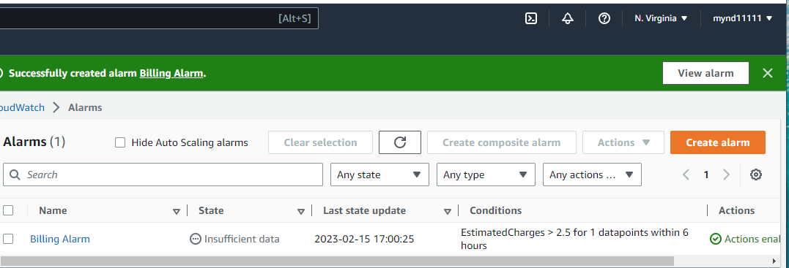
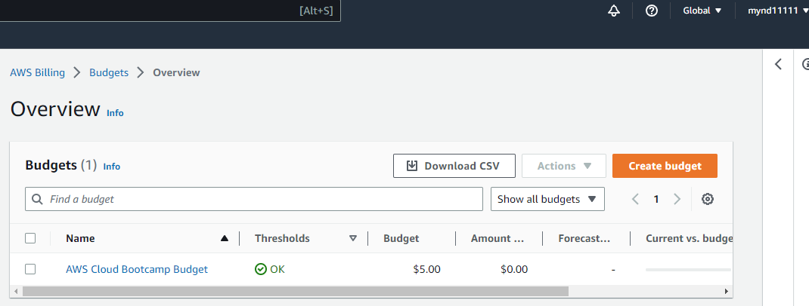

# Week 0 — Billing and Architecture

## Required Homework/Tasks

### Recreate CONCEPTUAL Diagram in Lucid Charts
I followed along with the class recording and created the same diagram. I'm not that familiar yet with all the services that are needed or where they would be placed in the diagram so I did not change anything from what was shown in the class recording.

[Lucid Chart CONCEPTUAL Diagram](https://lucid.app/lucidchart/146e3b81-83e6-442d-b014-a149b1736a52/edit?viewport_loc=357%2C-405%2C1041%2C1170%2C0_0&invitationId=inv_51edd285-3e83-439c-9439-318cfbe66165)

### Create Billing Alarm

 
### Create Budget

